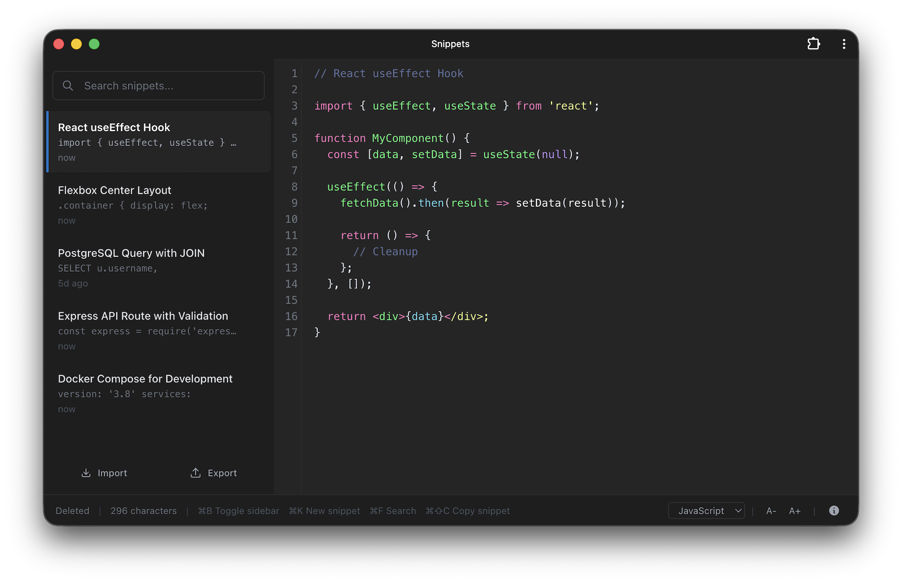

# Snippets
A minimal, keyboard-focused scratchpad for code snippets and notes. Everything is stored locally in the browser - no accounts, no servers. It's fast, dark-themed, installable as a PWA and works offline.

Try it now at [https://snippets.dev](https://snippets.dev)



## Features

- **Command palette**: ⌘/Ctrl+K to discover and run commands
- **Keyboard-first**: Fast, minimal interactions with clear shortcuts
- **Syntax highlighting**: Supports JavaScript, Python, SQL, Shell, Markdown, YAML, HTML, CSS, XML, TypeScript, JSON, and Plain Text
- **Automatic language detection**: Highlights code as content is entered; manual override available
- **Offline-first**: Functions as a PWA, no internet required
- **Local storage**: Data is stored in the browser
- **Export/Import**: Backup and restore quickly
- **Autosave**: Edits are saved automatically
- **Fast search**: Instant filtering in the sidebar

## Syntax Highlighting

Language detection is automatic, with manual selection available via the dropdown. Supported languages:
- JavaScript, TypeScript, JSON
- Python
- SQL
- Shell
- Markdown
- YAML
- HTML, CSS, XML
- Plain Text

## Creating Snippets

Typing in the editor autosaves changes. The first line is used as the sidebar title. Titles can be plain text or comment syntax:


```javascript
// React useEffect Hook
import { useEffect, useState } from 'react';
// ...
```

```python
# Python Data Processing
import pandas as pd
# ...
```

```sql
-- PostgreSQL Query
SELECT * FROM users WHERE active = true;
```


Supported title formats:
- Plain text (e.g. `My Notes`)
- `// Title` (JavaScript, TypeScript, C++)
- `# Title` (Python, Ruby, Bash)
- `-- Title` (SQL)
- `/* Title */` (CSS, JavaScript)
- `<!-- Title -->` (HTML)


## Command Palette

Open with ⌘/Ctrl+K. Commands include:
- New snippet
- Open file from disk
- Search snippets
- Toggle sidebar
- Copy current snippet
- Delete current snippet
- Export all snippets
- Import snippets
- Increase font size
- Decrease font size


## Keyboard Shortcuts

| Shortcut          | Action                                 |
|-------------------|----------------------------------------|
| ⌘/Ctrl + K        | Open command palette                   |
| ⌘/Ctrl + /        | Toggle sidebar                         |
| Esc               | Close palette/modal or clear search    |

Use the command palette to run all app actions (new snippet, open file, search snippets, toggle sidebar, copy, delete, export/import, increase/decrease font).


## Export & Import

- **Export:** Click Export in the sidebar to download all snippets/settings as JSON (`snippets-YYYY-MM-DD.json`).
- **Import:** Click Import to restore from a JSON file. Imports merge with existing snippets and restore settings.


## Tech Stack

- **Backend:** Node.js + Express (static only)
- **Frontend:** Vanilla JS, HTML, CodeMirror
- **Styling:** Tailwind CSS (built + minified via CLI)
- **Storage:** Browser localStorage
- **Testing:** Playwright


## Getting Started

1. **Install dependencies:**
   ```bash
   git clone https://github.com/wrlannen/snippets.git
   cd snippets
   npm install
   ```
2. **Run locally:**
   ```bash
   npm start
   # open http://localhost:3000
   ```

### Tailwind CSS

We use the Tailwind CLI to generate the stylesheet at `public/tailwind.output.css`.

- One-time build:
   ```bash
   npm run build:css
   ```
- Watch mode (keep running while developing):
   ```bash
   npm run dev:css
   ```

### JavaScript Bundling

Client-side code is bundled and minified using esbuild. Output files go to `public/dist/`:

- `public/dist/app.js` (bundled from `public/js/app.js`)
- `public/dist/sidebar-state.js` (minified early boot script)

To build everything (CSS + JS):
```bash
npm run build
```

Vendor scripts (CodeMirror and its addons) are concatenated into `public/dist/vendor.js` to keep network requests low.


## Docker

```bash
docker build -t snippets-app .
docker run -p 3000:3000 snippets-app
```


## Testing

Run all Playwright tests:
```bash
npm test
```
Or run interactively:
```bash
npm run test:ui
```

## Language Detection Tests

The app uses a robust, pattern-based language detection engine to automatically highlight code snippets. To ensure accuracy and avoid overfitting, the detection logic is tested against a large and diverse set of real-world code and text examples.

### Test Coverage
- **Languages tested:** JavaScript, Python, SQL, Shell, Markdown, YAML, HTML, CSS, XML, TypeScript, JSON, and Plain Text
- **Fixture-based tests:** 200+ test files (snippets) across all supported languages, including edge cases and ambiguous examples
- **Generalization:** New random examples are regularly added to ensure detection logic is not overfit to a fixed set

### How It Works
- The detection logic lives in `public/js/detect-language.js` and is shared by both the app and the test runner
- Each fixture file in `tests/fixtures/language-detection/` contains a code or text snippet and is named for its expected language
- The test runner (`npm run test:lang-fixtures`) loads all fixtures, runs detection, and checks for correct classification
- All detection tests must pass before merging changes

### Running Detection Tests
To run the language detection tests:
```bash
npm run test:lang-fixtures
```

- The output will show the number of passed/failed tests and details for any failures
- All Playwright UI tests must also pass (`npm test`)

### Adding New Fixtures
To add a new detection test:
1. Create a new file in `tests/fixtures/language-detection/<language>/` (e.g. `python/my-example.txt`)
2. Add a code or text snippet that represents a real-world or edge case for that language
3. Run `npm run test:lang-fixtures` to verify detection

See `tests/README.md` for more details on the test infrastructure.