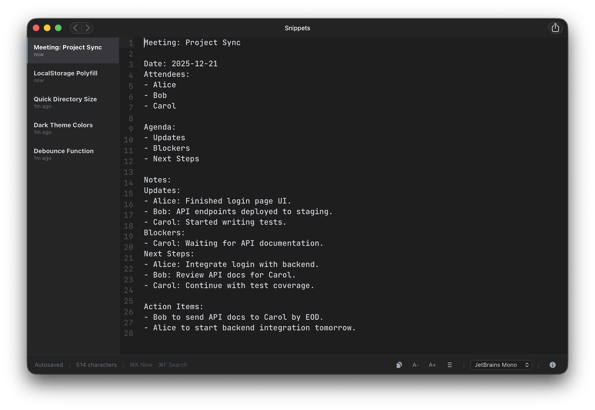

# Snippets: Minimal, Fast, Local


A lightweight, privacy-focused Node.js application for managing your personal text snippets. Built with a modern, minimal UI inspired by developer tools, it stores all your data directly in your browser's `localStorage` — no databases or external services required.

## ✨ Features

- **Blazing Fast**: Near-instant load times with a minimal backend.
- **Privacy First**: All snippets are saved locally in your browser.
- **Modern Editor**: 
  - Real-time autosave as you type.
  - Title overlay for the first line of your snippet.
  - Character count tracking.
  - Adjustable font sizes and customizable typography (Source Code Pro, Roboto Mono, etc.).
  - Line numbers with current line highlighting (toggleable).
  - One-click copy to clipboard functionality.
- **Smart Management**:
  - Sidebar for quick navigation.
  - Instant search (<kbd>⌘</kbd> <kbd>F</kbd>).
  - One-click deletion and creation.
- **Customizable Settings**:
  - Font family selection from multiple monospace fonts.
  - A+ / A- buttons for quick font size adjustment.
  - Toggle line numbers on/off.
  - All preferences persist across sessions.
- **Keyboard Optimized**:
  - <kbd>⌘</kbd> <kbd>K</kbd> to create a new snippet.
  - <kbd>⌘</kbd> <kbd>F</kbd> to search.
  - <kbd>Esc</kbd> to close search.

## 🚀 Getting Started

### Prerequisites

- [Node.js](https://nodejs.org/) (v18 or higher recommended)
- [npm](https://www.npmjs.com/)

### Installation & Run

1. Clone the repository:
   ```bash
   git clone https://github.com/your-username/snippets.git
   cd snippets
   ```

2. Install dependencies:
   ```bash
   npm install
   ```

3. Start the server:
   ```bash
   npm start
   ```

4. Open [http://localhost:3000](http://localhost:3000) in your favorite browser.

## 🐳 Docker Support

Run the application in a container without installing local dependencies:

```bash
# Build the image
docker build -t snippets-app .

# Run the container
docker run -p 3000:3000 snippets-app
```

## 🛠️ Tech Stack

- **Backend**: [Node.js](https://nodejs.org/) with [Express](https://expressjs.com/)
- **Frontend**: Vanilla JavaScript (ES Module) & HTML5
- **Styling**: [Tailwind CSS](https://tailwindcss.com/)
- **Storage**: Browser `localStorage` API
- **Testing**: [Playwright](https://playwright.dev/) for end-to-end testing

## 🧪 Testing

The project uses Playwright for UI and functional testing.

```bash
# Run all tests
npm test

# Open Playwright UI
npm run test:ui
```

---
*Created for speed and simplicity.*
